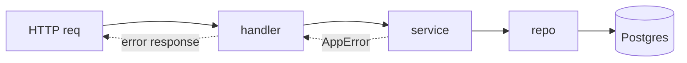

# Codebase pattern preview

Goal: before writing real code, show the human the EXACT patterns the codebase will follow — concrete example code, not prose. Output is an MDX doc in the Astro/Starlight dialect, reviewed via the repo docs site (`astro dev`) or as plain text. After sign-off and implementation, capture the same patterns as `.agents/rules` / `.agents/skills` inside that repo so future sessions enforce them.

This is language- and framework-agnostic. Do NOT assume a stack — interview first. Authoring rules (MDX blocks, Mermaid, discovery, read-only) come from the `astro-docs-authoring` skill.

## Step 1 — Interview (always first)

Never write the preview until these are answered. Ask only what's unknown; infer the rest from the repo if one exists.

- **Language(s) & runtime** — e.g. TypeScript/Node, Go, Python, Rust.
- **DB access layer** — e.g. Drizzle, Prisma, go-jet, sqlc, SQLAlchemy, raw SQL. Which DB?
- **Where business logic lives** — service layer? use-cases? domain package? path/convention.
- **HTTP router (if any)** — e.g. Hono, Express, chi, gin, Echo, FastAPI. Where router code lives.
- **Layering / boundaries** — how request → handler → service → repo flows. Any DI?
- **Error model** — error types, how errors propagate, how they map to HTTP responses.
- **Validation** — zod, go-playground/validator, pydantic, etc.
- **Function signature conventions** — context arg first? result/error tuple? wrapped Result type? naming.
- **Testing** — framework + where tests live.

Confirm user-facing vs backoffice-facing only if relevant. Prefer asking one focused question at a time.

## Step 2 — Write the MDX preview

Write one `.mdx` (or a small set) into `plans/` (non-ignored, non-dotted). Tell the user the path (promote/draft-place into the docs site for a rendered preview). Contents, in order:

1. **Overview** — stack summary in one paragraph (from the interview).
2. **Folder / package layout** — fenced tree showing where router, business logic, DB access, contracts, tests live.
3. **Layering diagram** — Mermaid: request → router → handler → service → repo → DB, plus error path.
4. **DB access pattern** — a representative query the chosen way (Drizzle/go-jet/etc.): schema/model, the query, and the repo function wrapping it. Show input params and return type.
5. **Function signature convention** — 2–3 example functions showing the in/out style the repo will use consistently (context arg, error return, Result type, naming).
6. **Business-logic example** — one service/use-case function end to end: inputs, validation, DB call, output, error cases.
7. **HTTP handler example** (if router) — request shape, calls service, success response, error → response mapping.
8. **Contract / types** — core data shape (zod / struct / pydantic) with a sample payload.
9. **Decisions** — every real pattern choice as a `<Decision status="proposed">` (ADR trail).
10. **Open questions** — `<Aside type="caution">` for anything still undecided.

Use `<Tabs>`/`<TabItem>` to show variants side by side (schema / query / sample; success / error response; two-language comparison). Prefer Mermaid over prose for any flow.

## Step 3 — After implementation: enforce via rules/skills

Once the human approves and the patterns are implemented in the repo, capture them so future sessions follow them automatically. In THAT codebase:

- **Path-scoped conventions** → `.agents/rules/<name>.md` with `paths:` frontmatter. e.g. a rule for `**/repo/*.ts` that says "every repo function takes ctx first and returns `Result<T, E>`; DB access only via Drizzle, never raw SQL."
- **Intent-triggered patterns / gotchas** → `.agents/skills/<name>/SKILL.md` with `name:` + `description:` frontmatter. e.g. "how to add a new endpoint: contract → service → handler → test, in this order."
- One rule/skill per coherent pattern. Keep them concrete and example-backed (link or inline the canonical example from the codebase).
- Mirror the approved `<Decision>` blocks into these files so the rationale survives.

Use the `promote-rules` / `promote-skills` skills if available to write these correctly.

## Example skeleton (TS + Drizzle shown; adapt to the interviewed stack)

````mdx
# Codebase patterns — <project>

Stack: TypeScript / Node, Hono router, Drizzle (Postgres), zod validation, service layer in `src/core`.

## Layout
```
src/
  routes/        # Hono handlers, thin
  core/          # business logic (use-cases)
  db/
    schema.ts    # Drizzle schema
    repo/        # repo functions, only DB access here
  contracts/     # zod schemas + inferred types
  lib/result.ts  # Result<T,E>
```

## Flow


## DB access (Drizzle)
<Tabs>
  <TabItem label="schema">
    ```ts
    export const users = pgTable("users", {
      id: uuid("id").primaryKey().defaultRandom(),
      email: text("email").notNull().unique(),
    });
    ```
  </TabItem>
  <TabItem label="repo">
    ```ts
    // repo functions: ctx first, return Result, no throw
    export async function findUserByEmail(
      ctx: Ctx, email: string,
    ): Promise<Result<User | null, DbError>> { /* db.query... */ }
    ```
  </TabItem>
</Tabs>

## Signature convention
```ts
// ctx first; validated input; Result out; never throw across layers
async function createUser(ctx: Ctx, input: CreateUserInput): Promise<Result<User, AppError>>
```

## Service example
```ts
async function createUser(ctx, input) {
  const parsed = CreateUser.safeParse(input);
  if (!parsed.success) return err(AppError.validation(parsed.error));
  const existing = await findUserByEmail(ctx, input.email);
  if (existing.ok && existing.value) return err(AppError.conflict("email taken"));
  // ...insert, return ok(user)
}
```

## Handler example
<Tabs>
  <TabItem label="handler">
    ```ts
    app.post("/users", async (c) => {
      const res = await createUser(ctx, await c.req.json());
      return res.ok ? c.json(res.value, 201) : toHttp(c, res.error);
    });
    ```
  </TabItem>
  <TabItem label="success">
    ```json
    { "id": "u_1", "email": "a@b.com" }
    ```
  </TabItem>
  <TabItem label="error">
    ```json
    { "error": "email taken", "code": "CONFLICT" }
    ```
  </TabItem>
</Tabs>

## Decisions
<Decision title="DB access only in db/repo, never in services/handlers" status="proposed">
Keeps SQL in one layer; services stay testable with fake repos.
</Decision>
<Decision title="Functions return Result<T,E>, never throw across layers" status="proposed">
Explicit error flow; handler maps Result.error to HTTP.
</Decision>
````

## Flow summary

1. Interview the stack (Step 1) — one question at a time.
2. Write the `.mdx` preview into `plans/`; tell the user the path (promote/draft-place into the docs site for a rendered preview).
3. Human reviews, flips `<Decision>` statuses, answers `<Aside>` questions.
4. Implement the approved patterns.
5. Capture them as `.agents/rules` / `.agents/skills` in that repo so future sessions enforce the style.
